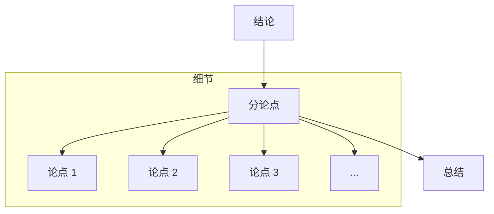
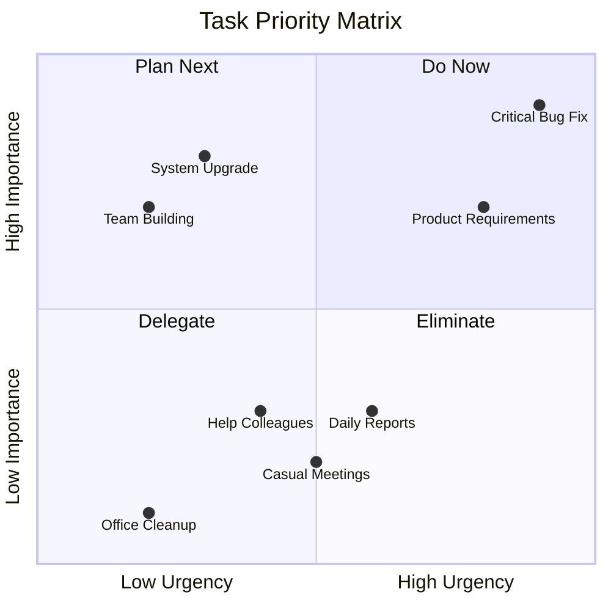

## 一、总分总模型：让表达更清晰

### 什么是总分总？

简单说就是：先说结论（总），再说细节（分），最后重申（总）。

就像写周报： "本周完成了订单系统优化（总） 具体包括修复了三个性能问题，优化了两个接口，新增了监控（分） 整体性能提升了30%（总）"

### 实战场景

#### 1. 写周报

差的版本： "这周修了三个bug，开发了两个功能，参加了四个会议..." （领导看完：所以重点是什么？）

好的版本： "这周主要完成了订单系统的性能优化（总） - 修复了三个性能瓶颈 - 优化了两个核心接口 - 系统响应提升了30% 整体达到了预期的优化目标（总）"

#### 2. 技术方案汇报

差的版本： "我们要用这个技术，那个框架，还要用什么什么..." （听众：所以你要做什么？）

好的版本： "这个方案主要解决订单峰值问题（总） - 优化系统架构 - 增加缓存机制 - 改进数据处理 通过这些措施，系统可以支撑双十一峰值（总）"

## 二、优先级四象限：让工作更高效

### 什么是优先级四象限？

把任务按照"重要"和"紧急"分成四类：

- 重要且紧急（第一象限）
- 重要不紧急（第二象限）
- 紧急不重要（第三象限）
- 不紧急不重要（第四象限）

### 实战场景

#### 1. 处理各种任务

- 重要且紧急：线上故障/重大bug/老板要的报告
- 重要不紧急：系统重构/技术升级/团队建设
- 紧急不重要：各种会议/日常报表/临时帮忙
- 不紧急不重要：闲聊八卦/整理工位

#### 2. 排期安排

早上来到公司：

- 产品经理说有个紧急需求
- 测试说发现个严重bug
- 运维说要升级系统
- 同事说要帮看个问题

按四象限排序： 

1. 先处理严重bug（重要且紧急） 
2. 再看紧急需求（评估重要性）
3. 安排系统升级（重要不紧急） 
4. 最后帮看问题（不紧急不重要）

## 三、STAR模型：让经历更有说服力

### 什么是STAR？

- Situation（情境）：什么背景
- Task（任务）：做什么事
- Action（行动）：怎么做的
- Result（结果）：达到什么效果

### 实战场景

#### 1. 写述职报告

差的版本： "我负责了订单系统的开发维护，完成了性能优化..."

好的版本： 
- Situation：
    - 订单系统在双十一期间频繁超时
- Task：
    - 需要优化系统性能，确保双十一稳定性
- Action：
    - 梳理系统瓶颈
    - 优化数据库查询
    - 引入缓存机制
    - 添加监控告警
- Result：
    - 系统响应时间降低70%
    - 双十一零故障
    - 经验在团队内推广

#### 2. 面试介绍项目

差的版本： "我做过订单系统，用了各种技术框架..."

好的版本： "S：公司准备双十一大促 T：负责订单系统的性能优化 A：通过以下步骤：

- 性能压测定位问题
- 优化系统架构
- 增加缓存机制
- 改进数据处理 R：系统最终支撑了双十一百万订单"

## 三大模型组合使用

### 核心模型

- 总分总(TST): 结构化表达的基础框架
- 四象限(4Q): 重点分析与决策工具
- STAR法则: 经验复盘与成果展示方法

### 场景应用矩阵

| 场景   | 应用                | 具体方法                                                |
| ---- | ----------------- | --------------------------------------------------- |
| 文档撰写 | TST构建框架 + 4Q突出重点  | 1. 用TST搭建整体骨架   2. 用4Q筛选核心内容   3. 用STAR展示关键案例 |
| 问题解决 | 4Q分析优先级 + STAR复盘  | 1. TST梳理问题脉络   2. 4Q评估解决方案   3. STAR记录解决过程    |
| 工作汇报 | TST组织逻辑 + STAR讲故事 | 1. TST设计演讲结构   2. 4Q突出核心成果   3. STAR展示具体案例    |

## 实践要诀

1. **聚焦精通**
    
    - 深入掌握少数几个高频工具
    - 在实践中形成肌肉记忆

2. **灵活运用**
    
    - 工具服务目的，而非限制思维
    - 根据具体场景动态调整使用方式
    - 在反复实践中找到最适合的应用方式

> 关键：这些模型的价值在于实践应用而非理论记忆。将它们视为思维工具包，在日常工作中持续使用和改进，直至成为自然反应。
