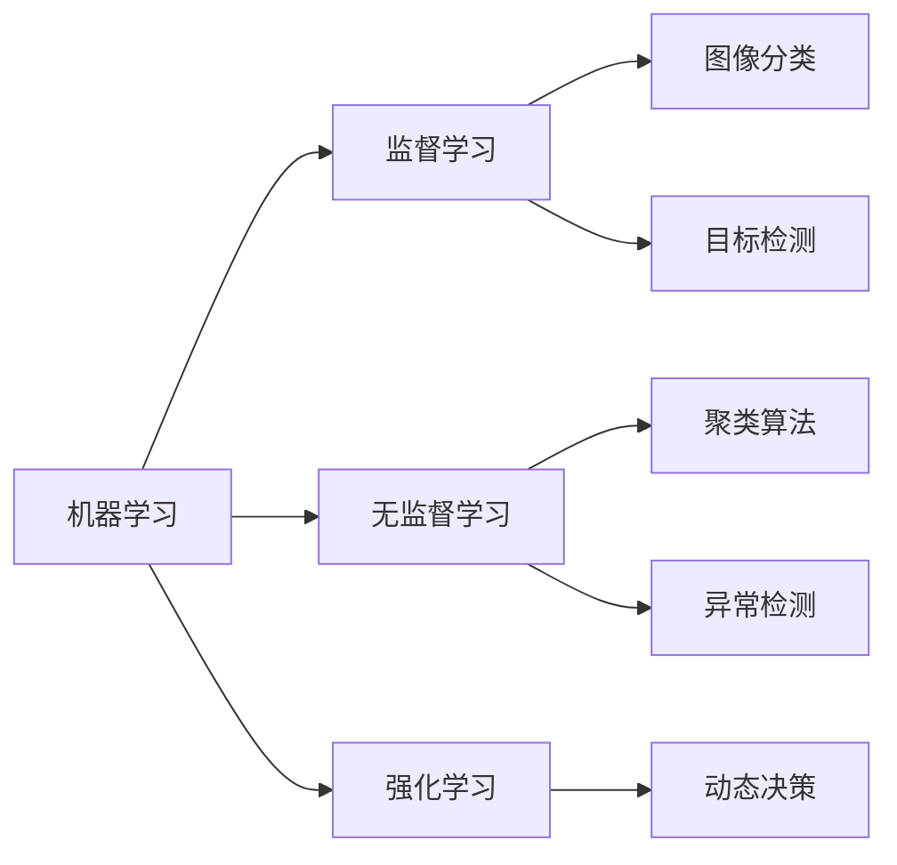
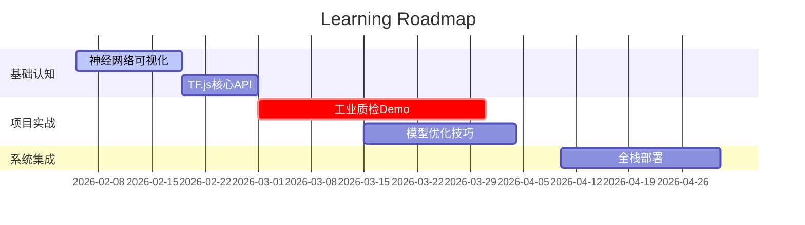
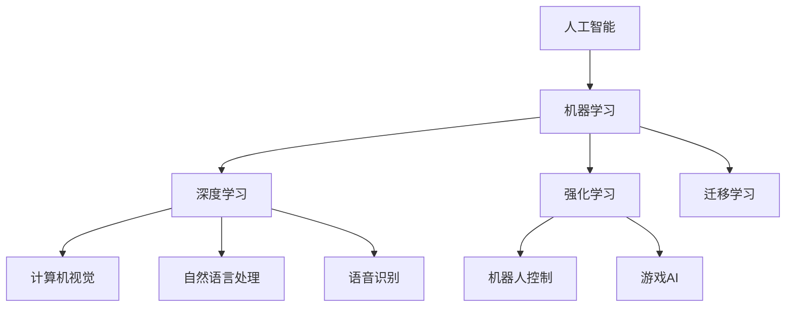

## 第一阶段：建立直觉认知（2 周）

1. 交互式学习平台
   - TensorFlow Playground - 可视化神经网络训练
   - CNN Explainer - 卷积网络交互演示
2. 关键技术衔接

## 第二阶段：关键技术衔接（4 周）

1. 算子设计实战（用 TensorFlow.js 实现）
   1. 实现一个基础的卷积算子
   2. 可视化特征图
2. 图像分割入门
   1. 使用 COCO-SSD 预训练模型

## 第三阶段：工业 AI 系统集成（8 周）

1. 全站 AI 项目架构：

工业质检系统技术栈：

- 前端标注工具：React + PixiJS
- Node.js 中间件：类 Express 如 encore.ts
- Python 训练集训：PyTorch + DVC

2. 推荐

- 书籍：[《JavaScript深度学习》](https://www.manning.com/books/deep-learning-with-javascript).
- 课程：Google - [Machine Learning Crash Course](https://developers.google.com/machine-learning/crash-course)
- 工具链：IJS - 交互式JavaScript机器学习环境

## 机器学习与深度学习之间有什么区别？

机器学习 (ML) 是训练计算机程序或系统在没有明确指令的情况下执行任务的科学。计算机系统使用机器学习算法来处理大量数据、识别数据模式并预测未知或新场景的准确结果。

深度学习是机器学习的一个子集，使用特定的算法结构，称为神经网络，以人脑为模型。深度学习方法试图自动执行通常需要人类智能的更复杂的任务。例如，您可以使用深度学习来描述图像、翻译文档或将声音文件转录为文本。

## 机器学习与深度学习之间有什么相似之处？

您可以使用机器学习 (ML) 和深度学习来识别数据中的模式。它们都依赖数据集来训练基于复杂数学模型的算法。在训练期间，算法会发现已知输出和输入之间的相关性。然后，模型可以根据未知输入自动生成或预测输出。与传统编程不同，它们的学习过程也是自动进行的，尽可能减少了人工干预。

以下是机器学习和深度学习之间的其他相似之处。

### 人工智能技术

机器学习和深度学习都是数据科学和人工智能 (AI) 的子集。它们都可以完成复杂的计算任务，如果采用传统的编程技术，这些任务需要大量的时间和资源才能完成。

### 统计基础

深度学习和机器学习都使用统计方法，通过数据集来训练算法。这些技术涉及回归分析、决策树、线性代数和微积分。机器学习专家和深度学习专家都非常了解统计数据。

### 大型数据集

机器学习和深度学习都需要大量高质量的训练数据才能做出更准确的预测。例如，机器学习模型需要每个特征提供大约 50-100 个数据点，而深度学习模型需要每个特征至少提供数千个数据点。

### 应用范围广泛多样

深度学习和机器学习解决方案可解决所有行业和应用程序的复杂问题。如果使用传统的编程和统计方法，则解决或优化这些类型的问题将花费更多的时间。

### 计算能力要求

训练和运行机器学习算法需要强大的计算能力，而由于深度学习的复杂性增加，其计算要求甚至更高。由于计算能力和云资源的最新发展，这两种解决方案现在都可用于个人用途。

### 逐步改进

随着机器学习和深度学习解决方案摄取更多数据，它们在模式识别方面将变得更加准确。将输入添加到系统后，系统会通过将其用作训练的数据点来进行改进。

## 机器学习的哪些局限性导致了深度学习的发展？

传统的机器学习 (ML) 需要通过特征工程进行大量的人工互动才能生成结果。例如，如果您正在训练机器学习模型对猫和狗的图像进行分类，则必须对其进行手动配置，以识别眼睛形状、尾巴形状、耳朵形状、鼻子轮廓等特征。

由于机器学习的目标是减少对人工干预的需求，因此深度学习技术消除了在每个步骤中对数据进行人工标记的需求。

尽管深度学习已经存在了几十年，但在 2000 年代初，Yann LeCun、Yoshua Bengio 和 Geoffrey Hinton 等科学家对这一领域进行了更详细的探索。尽管科学家们推进了深度学习，但在当时，大型、复杂的数据集有限，而且训练模型所需的处理能力成本高昂。在过去的 20 年中，这些条件有所改善，深度学习现在在商业上是可行的。

## 主要区别：机器学习和深度学习

深度学习是机器学习 (ML) 的子集。您可以把它看作是一种高级的机器学习技术。两者都有多种应用场景。但是，深度学习解决方案需要更多资源：更大的数据集、更多的基础设施要求和更高的后续成本。

以下是机器学习和深度学习之间的其他区别。

### 预期应用场景

使用机器学习还是深度学习的决定取决于您需要处理的数据类型。机器学习从结构化数据（例如分类和推荐系统）中识别模式。例如，一家公司可以使用机器学习根据先前的客户流失率数据预测客户何时会取消订阅。

另一方面，深度学习解决方案更适合非结构化数据，在非结构化数据中，需要高度的抽象化才能提取特征。深度学习的任务包括图像分类和自然语言处理，其中需要识别数据对象之间的复杂关系。例如，深度学习解决方案可以分析社交媒体的提及情况，以确定用户的情绪。

### 解决问题的方法

传统机器学习通常需要执行特征工程，即人们从原始数据中手动选择和提取特征并为其分配权重。相反，深度学习解决方案只需最少的人工干预即可执行特征工程。

深度学习的神经网络架构在设计上更加复杂。深度学习解决方案的学习方式以人脑的工作方式为模型，节点代表神经元。深度神经网络由三层或更多层节点组成，包括输入层和输出层节点。

在深度学习中，神经网络中的每个节点都会自动为每个特征分配权重。信息从输入到输出，沿正向方向流经网络。然后计算预测产出和实际产出之间的差异。这个错误通过网络反向传播以调整神经元的权重。

由于自动加权过程、架构层次的深度以及所使用的技术，因此需要通过模型来为深度学习中远多于机器学习的运算求解。

### 训练方法

机器学习有四种主要的训练方法：有监督学习、无监督学习、半监督学习和强化学习。其他训练方法还包括迁移学习和自监督学习。

相比之下，深度学习算法使用几种更复杂的训练方法。其中包括卷积神经网络、循环神经网络、生成式对抗网络和自动编码器。

### Performance

机器学习和深度学习都有特定的用例，它们在这些用例中的性能优于其他用例。

对于较简单的任务，例如识别新的垃圾邮件，机器学习较为适用，而且通常会优于深度学习解决方案。对于较复杂的任务，例如医学成像识别，深度学习解决方案的性能优于机器学习解决方案，因为前者可以识别肉眼看不见的异常。

### 人工参与

机器学习和深度学习解决方案都需要大量的人工参与才能发挥作用。必须通过人工定义问题、准备数据、选择和训练模型，然后评估、优化和部署解决方案。

机器学习模型可能更易于人们解释，因为它们源自决策树等更简单的数学模型。

相反，深度学习模型需要花费大量时间才能进行详细分析，因为这些模型在数学上很复杂。话虽如此，但神经网络的学习方式消除了对数据进行人工标记的需求。您可以通过选择预先训练的模型和平台来进一步减少人工参与。

### 基础设施要求

由于深度学习模型更复杂且需要更大的数据集，因此与机器学习模型相比，深度学习模型需要更高的存储和计算能力。机器学习数据和模型可以在单个实例或服务器集群上运行，深度学习模型则通常需要高性能集群和其他重要基础设施。

深度学习解决方案的基础设施要求可能导致其成本比机器学习高出许多。对于运行深度学习解决方案，现场基础设施可能不实用或不划算。您可以使用可扩展的基础设施和完全托管的深度学习服务来控制成本。

## 差异摘要：机器学习与深度学习

| 对比维度          | 机器学习 | 深度学习 |
| :---------------- | -------- | -------- |
| 定义              | 通过算法解析数据并做出决策的AI方法 | 基于深层神经网络的机器学习子领域 |
| 所属关系          | 包含深度学习在内的广泛领域 | 机器学习的分支 |
| 适用场景          | ✅ 结构化数据（表格数据） ✅ 明确规则的任务   | ✅ 非结构化数据（图像/文本） ✅ 复杂模式识别 |
| 处理方式          | 机器学习通过统计和数学解决问题。   | 深度学习将统计学和数学与神经网络架构相结合。 |
| 特征处理          | 依赖人工特征工程   | 自动特征学习 |
| 训练方式          | 需要清晰的特征工程和参数调整   | 端到端训练，自动优化权重 |
| 硬件需求          | CPU 即可运行   | 需要 GPU/TPU 加速 |
| 可解释性          | 较高（可通过 SHAP 值等解释）   | 较低（需借助 Grad-CAM 等可视化工具） |
| 工业部署          | 嵌入式设备/边缘计算 | 云端推理/专用AI加速卡 |

## 学习资源

- 复旦邱博 - 神经网络与深度学习 蒲公英
- 李宏毅老师
- 李沐老师

- 编程语言：Python
- 理论知识：李宏毅（中）｜吴恩达（英）
- 编程实战：李沐
- 快速上手：学不会的电磁炮
