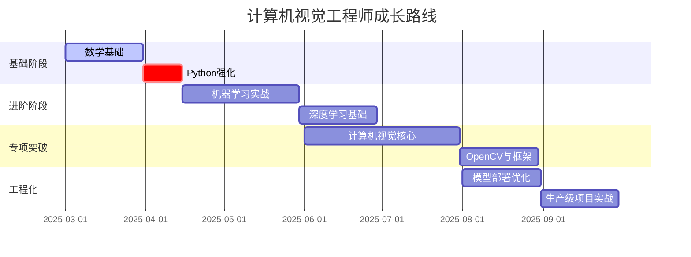

# 工业级计算机视觉应用
  


## 阶段一：基础夯实（6周）

### 1. 数学基础（2周）
  
- 线性代数：矩阵运算、特征分解（推荐3Blue1Brown视频）
- 概率统计：贝叶斯定理、分布函数（使用NumPy实践）
- 优化方法：梯度下降、凸优化（推导+Python实现）  

### 2. Python工程化（1周）

```python

# 工业级代码示例
class CVATPipeline:
    def __init__(self):
        self._init_logging()
    
    @staticmethod
    def _init_logging():
        logging.basicConfig(
            format='%(asctime)s - %(levelname)s - %(message)s',
            level=logging.INFO
        )
    
    def process_image(self, img_path: str) -> np.ndarray:
        """标准化图像处理管道"""
        try:
            img = cv2.imread(img_path)
            img = cv2.cvtColor(img, cv2.COLOR_BGR2RGB)
            return self._normalize(img)
        except Exception as e:
            logging.error(f"Process failed: {str(e)}")
            raise CVATProcessingError from e

```

### 3. 机器学习基础（3周）

- 掌握Scikit-learn核心API
- 实现经典算法（决策树/SVM）
- 特征工程实战（Kaggle Titanic项目）

## 阶段二：深度学习突破（8周）

### **1. PyTorch工程实践（3周）**

```python

# 工业级训练循环模板
def train_epoch(model, loader, criterion, optimizer, device):
    model.train()
    for batch in tqdm(loader):
        inputs = batch['image'].to(device)
        labels = batch['label'].to(device)
        
        optimizer.zero_grad()
        outputs = model(inputs)
        loss = criterion(outputs, labels)
        loss.backward()
        optimizer.step()
```

### **2. 计算机视觉基础（5周）**

- 图像处理：OpenCV高级操作（仿射变换/特征匹配）
- 经典网络复现：ResNet/YOLO实战
- CVAT集成开发：实现自动标注插件

## 阶段三：专项攻坚（8周）

### **1. 工业视觉项目（4周）**

- 缺陷检测：使用MMDetection
- OCR系统：基于PaddleOCR
- 视频分析：使用SlowFast

### **2. 模型优化（2周）**

```python
# 模型量化示例
torch.quantization.quantize_dynamic(
    model, {torch.nn.Linear}, dtype=torch.qint8
)
```

### **3. MLOps实践（2周）**

- 使用MLflow跟踪实验
- 构建Docker化服务
- 实现CI/CD管道  

## 学习资源推荐

### 书籍

- 《深度学习入门：基于Python的理论与实现》（斋藤康毅）
- 《OpenCV 4计算机视觉项目实战》

### 在线课程

- Fast.ai实战深度学习 https://course.fast.ai/
- Kaggle微课程 https://www.kaggle.com/learn

### 工具链

**工具链**： | 类别 | 推荐工具 | 应用场景 | |--------------|--------------------------|---------------------| | 开发框架 | PyTorch Lightning | 快速原型开发 | | 可视化 | TensorBoard | 训练监控 | | 部署 | ONNX Runtime | 跨平台部署 | | 数据版本控制 | DVC | 数据集管理 |

```tabular
计算机视觉工具链
─────────────────────────────────────────────────
 类别           推荐工具             应用场景        
─────────────────────────────────────────────────
 开发框架       PyTorch Lightning    快速原型开发     
 可视化         TensorBoard          训练监控         
 部署           ONNX Runtime         跨平台部署       
 数据版本控制   DVC                  数据集管理       
─────────────────────────────────────────────────
```


## 学习安排

### 项目里程碑

1. **Month 1**：开发基于OpenCV的标注辅助工具（自动去噪/图像增强）
2. **Month 3**：在CVAT中集成YOLOv8自动标注功能
3. **Month 5**：构建端到端缺陷检测系统（准确率≥90%）
4. **Month 6**：实现模型服务化部署（响应时间≤200ms）

### 学习策略

1. **费曼技巧**：每周录制5分钟技术讲解视频
2. **代码考古**：研究CVAT等开源项目实现
3. **知识管理**：使用Obsidian建立知识图谱
4. **社区参与**：每月贡献1个开源PR

### 时间安排

```calendar
每周投入10-15小时：
- 工作日：19:00-21:00（理论学习+代码实践）
- 周末：09:00-12:00（项目开发）
- 通勤时间：技术播客/论文速读`
```

此路径聚焦工业场景需求，强调工程实现与理论结合，建议配合实际工作需求动态调整学习重点。