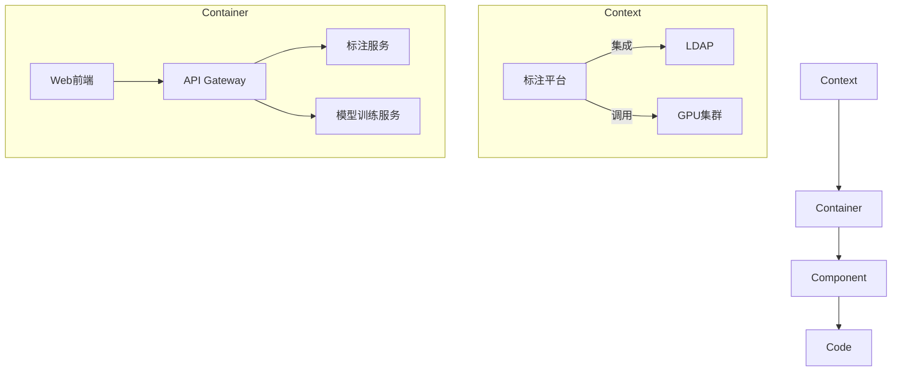
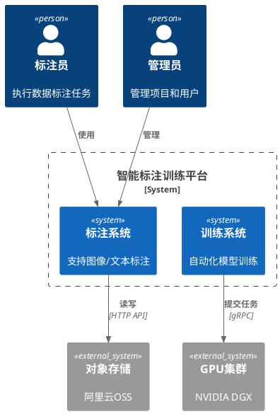

每周需要进行的一些事情：

- [ ] 算法：保持手感
- [ ] 机器学习：
- [ ] 图形学：WebGL / Shader[[]]
- [ ] Obsidian 改造，弃用 Notion
- [ ] 博客：借助 Obsidian 进行内容创作
- [ ] 主题：搞一套 UI 方案，结合 shadcn/ui magicui 和 motion 的能力
- [ ] 主页：新的 UI 库 + threejs 的方案
- [ ] 健身
- [ ] 饮食

