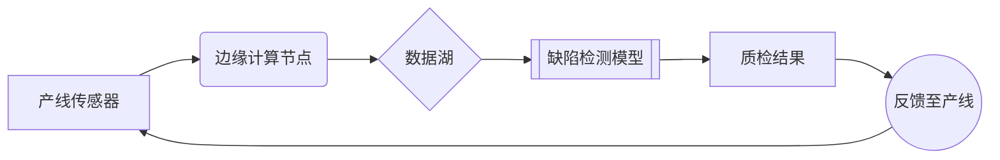

## 核心挑战

1. 小样本冷启动问题 → 解决方案：[[虚拟缺陷生成技术]]
2. 数据分布漂移 → 解决方案：[[在线主动学习系统]]

## 架构特性

```mermaid
graph LR
A[产线传感器] --> B(边缘计算节点)
B --> C{数据湖}
C --> D[[缺陷检测模型]]
D --> E[质检结果]
E --> F((反馈至产线))
F --> A
```

关键技术：

- [[数据版本控制]]
- [[模型性能监控]]
